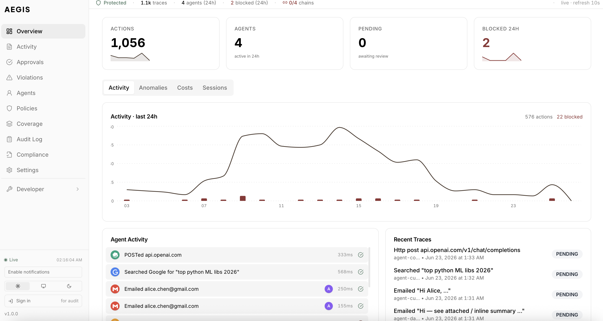

<div align="center">

# AEGIS

### The firewall for AI agents.

**Every tool call. Intercepted. Classified. Blocked — before it executes.**

<br>

[](https://github.com/Justin0504/Aegis/releases/latest)
[](https://github.com/Justin0504/Aegis/stargazers)
[](https://opensource.org/licenses/MIT)
[](https://pypi.org/project/agentguard-aegis/)
[](https://www.npmjs.com/package/@justinnn/agentguard)
[](https://github.com/Justin0504/Aegis/pkgs/container/aegis-gateway)
[](https://github.com/Justin0504/Aegis/actions)

[**Website**](https://aegistraces.com) ·
[**Docs**](./GETTING_STARTED.md) ·
[**Architecture**](./docs/ARCHITECTURE.md) ·
[**Operations**](./docs/OPERATIONS.md) ·
[**Roadmap**](./ROADMAP.md) ·
[**Discord**](https://aegistraces.com/community)

</div>

<br>

<div align="center">

<br>
<sub>The AEGIS Compliance Cockpit — real-time monitoring across every agent, every tool call.</sub>
</div>

<br>

> Your agent just called `DROP TABLE users` because the prompt said "clean up old records." Your agent just exfiltrated 2 GB because "the user asked for a report." Your agent just ran `rm -rf /` because the model hallucinated a tool name.
>
> **Not hypotheticals.** Every agent framework lets AI decide which tools to call, at machine speed, with no human in the loop and no undo.
>
> AEGIS is the missing layer: a **pre-execution firewall** that classifies every call, enforces policies, blocks violations, and writes a tamper-evident audit trail — with **one line of code and zero agent changes**.

## Quick start

**Docker Compose** (30 s):

```bash
git clone https://github.com/Justin0504/Aegis && cd Aegis
docker compose up -d
```

Cockpit at [localhost:3000](http://localhost:3000). Gateway at
[localhost:8080](http://localhost:8080). Prefer a hosted deploy? One-click on
[Render](https://render.com/deploy?repo=https://github.com/Justin0504/Aegis) ·
[Railway](https://railway.app/new/template?template=https%3A%2F%2Fgithub.com%2FJustin0504%2FAegis) ·
[Fly.io](./fly.toml) — the config ships in-tree.

**Then wire your agent** — one line, no code change:

```python
import agentguard
agentguard.auto("http://localhost:8080", agent_id="my-agent")

# Your existing agent code — completely unchanged.
import anthropic
anthropic.Anthropic().messages.create(model="claude-sonnet-4", tools=[...], messages=[...])
```

Every tool call is now classified, policy-checked, and recorded in a tamper-evident audit trail **before** execution. Full quickstart in [`GETTING_STARTED.md`](./GETTING_STARTED.md).

## What you get

- **Pre-execution blocking** — deny the call, don't rewrite the prompt. The agent gets a structured `AgentGuardBlockedError` with the reason.
- **9 frameworks auto-instrumented** — Anthropic, OpenAI, LangChain, CrewAI, AutoGen, Gemini, Bedrock, Mistral, LlamaIndex. Add `import agentguard` and go.
- **DSL search + FTS5** — `agent:foo AND @args.amount:>10000 AND "refund"` runs sub-100ms at 25k traces. See the [DSL grammar](./packages/gateway-mcp/src/services/trace-query-dsl.ts).
- **Reversible actions** — saga machine + causal DAG + compensator webhooks. Charged a customer by mistake? One button rolls the Stripe refund.
- **RFC 6962 transparency log** — every audit row is Merkle-proof verifiable offline. Same standard as browser certificate transparency.
- **Multi-tenant + SOC 2 framework** — every mutable resource org-scoped and CI-verified by the [`test:isolation` harness](./docs/TESTING.md#tenant-isolation--npm-run-testisolation).
- **Prometheus + Grafana** — [importable dashboards](./tools/grafana/) for RED metrics + rollback subsystem.

## How it works

```
                  ┌────────────┐    check    ┌───────────────────────┐
   agent  ──────► │  AEGIS SDK │  ────────►  │      AEGIS Gateway    │
   tool call      │  (1 line)  │             │  ─────────────────    │
                  └──────┬─────┘             │  1. Classify tool     │
                         │                   │  2. Anomaly detect    │
                         │  allow            │  3. Policy DSL        │
                         │  ◄──────────────  │  4. LLM judge (opt)   │
                         │  block            │  5. Decide            │
                         │  human-approve    └────────┬──────────────┘
                         │                            │
                         ▼                            ▼
                  ┌────────────┐              ┌──────────────────┐
                  │   tool     │  ──trace──►  │  Transparency    │
                  │   runs     │              │  log (RFC 6962)  │
                  └────────────┘              └──────────────────┘
```

The five-stage cascade runs in ~2 ms on the hot path (p95 4.8 ms at 50 VUs — see [`PERFORMANCE.md`](./PERFORMANCE.md)). Every stage is short-circuitable; the first to `block` wins.

## Where the code lives

| Package | What it is | Language |
|---|---|---|
| [`packages/gateway-mcp/`](./packages/gateway-mcp) | Gateway — policy, audit, rollback, DSL search, `/metrics` | TypeScript |
| [`packages/sdk-python/`](./packages/sdk-python) | Python SDK — 9 frameworks + reliability layer | Python |
| [`packages/sdk-js/`](./packages/sdk-js) | JS/TS SDK — Anthropic, OpenAI, LangChain, Vercel AI | TypeScript |
| [`packages/sdk-go/`](./packages/sdk-go) | Go SDK — stdlib only | Go |
| [`packages/cli/`](./packages/cli) | `agentguard` CLI — 48 subcommands, `--json`, `tail`, `replay` | TypeScript |
| [`apps/compliance-cockpit/`](./apps/compliance-cockpit) | Next.js dashboard | TypeScript |
| [`apps/marketing/`](./apps/marketing) | aegistraces.com | Astro |

Deeper reads: [`docs/ARCHITECTURE.md`](./docs/ARCHITECTURE.md) · [`docs/OPERATIONS.md`](./docs/OPERATIONS.md) · [`docs/TESTING.md`](./docs/TESTING.md).

## Comparison

The agent-guardrail category is consolidating around two camps: closed enterprise platforms (Cisco AI Defense, Palo Alto Prisma AIRS) and narrow open-source libraries (LlamaFirewall, NeMo, Guardrails AI). **AEGIS is the open-source project that ships the full vertical** — gateway, cascade, DSL, dashboard, audit trail, rollback, approvals — in one repo. Full side-by-side matrix at [aegistraces.com/compare](https://aegistraces.com/compare).

## Testing

Four harnesses layered from cheap to thorough. Total ~35 s wall-clock for a full-matrix green.

```bash
npm test                    # 97 suites, 1241 unit + integration tests
npm run test:e2e            # 12 golden HTTP paths against a live gateway
npm run test:isolation      # 6 cross-tenant leak checks
npm run test:sdk-chaos      # 5 SDK reliability scenarios (gateway kill + replay)
```

See [`docs/TESTING.md`](./docs/TESTING.md) for scenario details and CI wiring.

## Community & support

- **Bugs / feature requests** — [issues](https://github.com/Justin0504/Aegis/issues)
- **Security disclosures** — [`SECURITY.md`](./SECURITY.md) or `security@aegistraces.com`
- **Discord** — [community.aegistraces.com](https://aegistraces.com/community)
- **Twitter / X** — [@aegistraces](https://twitter.com/aegistraces)
- **Commercial licenses / SaaS** — [`COMMERCIAL.md`](./COMMERCIAL.md) or `partners@aegistraces.com`

## Contributing

Pull requests welcome. Please read [`CONTRIBUTING.md`](./CONTRIBUTING.md) first — it covers the branch model, test matrix, DCO sign-off, and a checklist for adding new detectors, compensators, and SDK integrations. Every change needs to keep the four-harness CI matrix green.

## Prior art we implement

AEGIS is an implementation of well-published designs, not a new invention:

- **RFC 6962** — Certificate Transparency Merkle log
- **Toledo et al.** [arXiv:2606.09692](https://arxiv.org/abs/2606.09692) — delegation-scoped observability
- **Toledo et al.** [arXiv:2606.07119](https://arxiv.org/abs/2606.07119) — Three-Ring architecture
- **Garcia-Molina + Salem 1987** — Saga state machines
- **Nygard, "Release It!"** — Circuit breaker (in the SDK reliability layer)

## License

MIT for the engine; commercial licenses available for the cloud control plane and enterprise support. See [`LICENSE`](./LICENSE) and [`COMMERCIAL.md`](./COMMERCIAL.md).

<br>

<div align="center">
<sub>Built at USC with the NVIDIA Academic Grant Program. Star the repo if it saved your agent from doing something dumb.</sub>
</div>
